# 使用PyTorch微调BERT实现漏洞分类模型

## BERT

[BERT](https://ar5iv.labs.arxiv.org/html/1810.04805)（Bidirectional Encoder Representations from Transformers）是由谷歌在2018年提出的一种基于 Transformer 架构的预训练语言模型。本质是由多个 Transformer 编码器层顺序连接构成，通过预训练任务（如MLM和NSP）学习到双向上下文表征的深度模型。

BERT 模型开发经过两个步骤：

1. 在大量文本上进行**半监督训练**以掌握语言模式和语言处理能力。
2. 使用在第一步中预训练好的模型，在带标签数据集上针对特定任务进行**微调**（**监督训练**）。


可以通过 [GitHub](https://github.com/google-research/bert) 或 [Hugging Face](https://huggingface.co/google-bert/bert-base-uncased) 下载预训练好的模型，使用 Hugging Face 的 [Transformers](https://huggingface.co/docs/transformers/quicktour) 库可以方便的使用各种模型。


### 模型架构

BERT base 模型由12层 Transformer 编码器构成，含12个注意力头，隐藏单元大小为768，参数约110M。BERT large 模型由24层 Transformer 编码器构成，有16个注意力头，隐藏单元大小为1024，参数约340M。


#### 模型输入

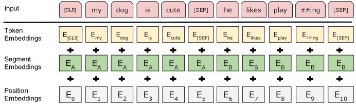

BERT 的理论输入由以下三部分构成：

* **Token Embeddings**（文本分词后每个 token 的向量表示）
* **Segment Embeddings**（通过标记 `0` 或 `1` 表示 token 属于第一句还是第二句，帮助模型识别句子边界） 
* **Position Embeddings** （为每个 token 添加位置信息编码，使 Transformer 能感知输入序列的顺序）


在代码框架 Hugging Face Transformers 中，输入参数是 `input_ids`、`token_type_ids` 和 `attention_mask`。模型内部通过 `Token Embedding` 层将 `input_ids` 转换为向量（每个token对应的向量纬度大小等于隐藏单元大小），通过 `Segment Embedding` 层转换`token_type_ids`，通过 `Position Embedding` 层直接生成位置编码，`attention_mask` 用于标识哪些位置是真实 token，哪些是填充token（Padding）。

测试代码如下：

```python
from transformers import BertTokenizer, BertModel

bert_tokenizer = BertTokenizer.from_pretrained("google-bert/bert-base-uncased")
bert_base_model = BertModel.from_pretrained("google-bert/bert-base-uncased")
bert_large_model = BertModel.from_pretrained("google-bert/bert-large-uncased")

text = "Hello World!"

inputs = bert_tokenizer(text, return_tensors='pt')
print(f'inputs: {inputs}')
tokens = bert_tokenizer.convert_ids_to_tokens(inputs['input_ids'][0].tolist())
print(f'tokens: {tokens}')
bert_base_token_embeddings = bert_base_model.embeddings.word_embeddings(inputs['input_ids'])
bert_large_token_embeddings = bert_large_model.embeddings.word_embeddings(inputs['input_ids'])
print(f'bert_base_token_embeddings shape: {bert_base_token_embeddings.shape}')
print(f'bert_large_token_embeddings shape: {bert_large_token_embeddings.shape}')
```

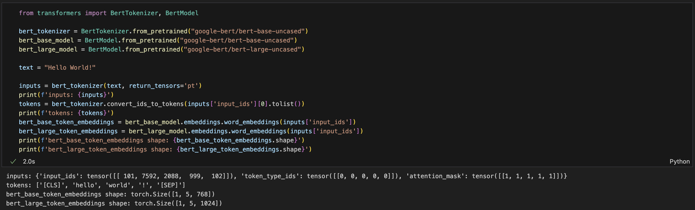


`[CLS]`即分类标记（Classification Token），位于输入序列的起始位置。`[SEP]`是分隔标记（Separator Token），用于分隔不同的文本片段，比如在文本对任务中区分两个句子，帮助模型明确不同文本之间的界限。

输入文本逐层通过 self-attention 机制和前馈神经网络进行处理和转换，每个词本身的 embedding 始终作为主要语义基向量，同时其他词的语义通过注意力权重加权补充，形成更丰富的向量表征。经过多层迭代，每个词的最终 embedding 实质上是全局语义的深度整合。

`[CLS]`作为无实际语义的占位符，每层注意力计算中，它不携带初始语义信息，仅作为信息聚合节点接收来自全体词汇的加权特征。经过多层传递后，`[CLS]`最终形成全局语义的压缩表征，相比携带自身语义干扰的常规词汇，可以更好的表征文本语义。

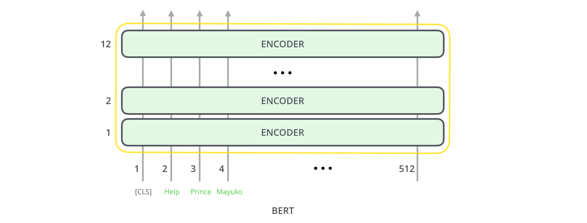

BERT模型的最大输入长度通常为512个 token，这是由其预训练时使用的固定序列长度决定的，主要受限于 Transformer self-attention 机制的计算复杂度和训练资源限制。若输入过长，通常采用截断（舍弃超长部分）或分段处理（将文本拆分为多段分别输入后合并结果）；同一批次内输入长度不一时，通过填充（padding）短文本至批次最大长度并用 `[PAD]` 标记补位）结合注意力掩码（masking）屏蔽填充部分。


#### 模型输出

每个位置输出一个大小为 `hidden_size` （隐藏单元大小）的向量。对于分类任务，通常只关注第一个位置的输出。

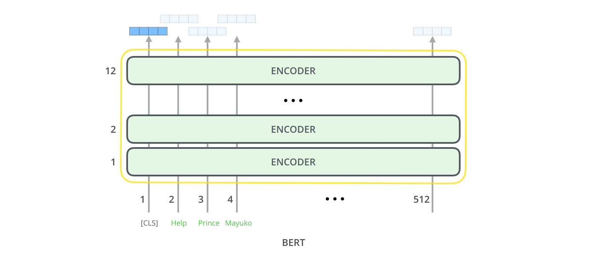

该向量可以用作分类器的输入。

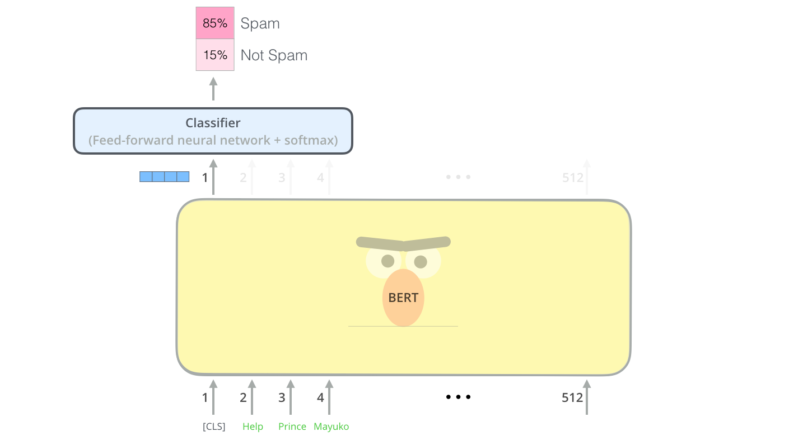


在代码框架 Hugging Face Transformers 中，BERT模型的输出主要包含 `last_hidden_state` 和 `pooler_output` 两部分：

* **last_hidden_state**
  * 形状：[batch_size, sequence_length, hidden_size]
  * 含义：模型最后一层输出的所有 token 的隐藏状态（每个 token 的上下文向量表示）
* **pooler_output**
  * 形状：[batch_size, hidden_size]
  * 含义：对 `[CLS]` token 的最后一层隐藏状态进一步通过一个线性层 + tanh 激活后的表示


代码如下：

```python
from transformers import BertTokenizer, BertModel
import torch

tokenizer = BertTokenizer.from_pretrained("google-bert/bert-base-uncased")
model = BertModel.from_pretrained("google-bert/bert-base-uncased")

text = "Hello World!"

inputs = tokenizer(text, return_tensors='pt')
print(f'input_ids shape: {inputs["input_ids"].shape}')
outputs = model(**inputs, output_hidden_states=True)
print(f'last_hidden_state shape: {outputs.last_hidden_state.shape}')
print(f'pooler_output shape: {outputs.pooler_output.shape}')

# 获取 [CLS] 的隐藏状态
cls_hidden_state = outputs.last_hidden_state[0][0]
# 线性变换
linear_output = torch.matmul(cls_hidden_state, model.pooler.dense.weight.T) + model.pooler.dense.bias
# Tanh 激活
manual_pooler_output = torch.tanh(linear_output)
print(torch.all(manual_pooler_output == outputs.pooler_output[0]))
```

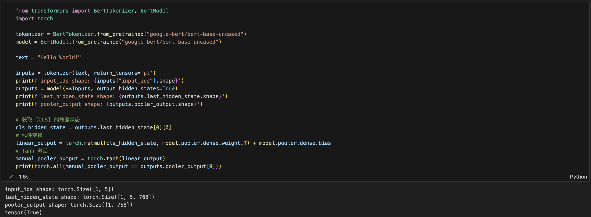


## 环境准备

我是在MacBook M2上编写代码并做简单测试，不过即使有 [MPS](https://pytorch.org/docs/stable/notes/mps.html) 加速，用来微调模型也相当费劲，所以训练我是放到云厂商的免费云空间跑的。

Python依赖如下：

```
torch==2.5.1
transformers==4.48.3
datasets==3.2.0
matplotlib==3.10.0
scikit-learn==1.6.1
```


另外国内访问 Hugging Face 需要通过镜像站：

```python
import os
os.environ['HF_ENDPOINT'] = 'https://hf-mirror.com'
```


检查并使用GPU：

```python
import torch

if torch.cuda.is_available():
    device = torch.device('cuda')
elif torch.backends.mps.is_available():
    device = torch.device('mps')
else:
    device = torch.device('cpu')

torch.set_default_device(device)
print(f"Using device = {torch.get_default_device()}")
```


## 数据获取和预处理

Hugging Face Hub 中有 [HackerOne 的公开漏洞报告数据集](https://huggingface.co/datasets/Hacker0x01/hackerone_disclosed_reports)，做漏洞分类暂只会用到其中的`title`，`vulnerability_information` 和 `weakness` ，先简单的过滤一下：

```python
from datasets import load_dataset

dataset = load_dataset("Hacker0x01/hackerone_disclosed_reports")
dataset = dataset.filter(
    lambda example:
    example["title"] is not None and
    example["vulnerability_information"] is not None and
    example["weakness"] is not None
)
print(dataset)
```

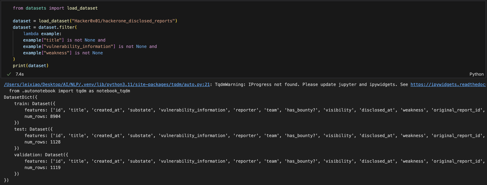


报告中包含的漏洞类型很多，画了个条形图看一下大致占比：

```python
import matplotlib.pyplot as plt
from collections import Counter

weakness_types = [item["weakness"]["name"] for item in dataset["train"]]
type_counter = Counter(weakness_types)
sorted_counts = sorted(type_counter.items(), key=lambda x: x[1])
labels = [x[0] for x in sorted_counts]
values = [x[1] for x in sorted_counts]
total = sum(values)

plt.figure(figsize=(10, 24))
plt.bar_label(
    plt.barh(labels, values),
    labels= [f"{v} ({v/total:.3%})" for v in values],
)
plt.xlim(right=max(values)*1.6)
plt.tight_layout()
plt.title(f"Number of vulnerability types: {len(labels)}")
plt.show()
```

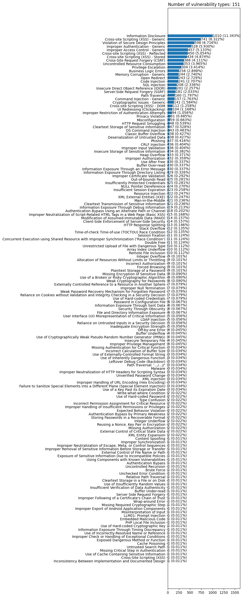


大多数漏洞类型的报告数量都很少，模型可能无法有效学习，所以我将占比小于0.24%的都归为了Other类（剩余总共48种漏洞类型）。并在数据集中添加了 label 列表示漏洞类型，其值为 main_types 的下标：

```python
main_types = [k for k,v in type_counter.items() if v > total*0.0024]
main_types.append("Other")
print(f"漏洞类型数量: {len(main_types)}")
dataset = dataset.map(lambda example: {'label': main_types.index(example["weakness"]["name"]) if example["weakness"]["name"] in main_types else len(main_types)-1 })
```


然后对数据进行分词处理，将文本转换为模型能够理解的数字，并只保留有用的列：

```python
from transformers import BertTokenizer
import transformers

tokenizer = BertTokenizer.from_pretrained("google-bert/bert-base-uncased")

def tokenize_function(example):
    return tokenizer(example["title"], example["vulnerability_information"], padding=True, max_length=512, truncation=True)

verbosity = transformers.logging.get_verbosity(); transformers.logging.set_verbosity_error()
tokenized_datasets = dataset.map(tokenize_function, batched=True)
transformers.logging.set_verbosity(verbosity)
tokenized_datasets = tokenized_datasets.select_columns(['input_ids', 'token_type_ids', 'attention_mask', 'label'])
tokenized_datasets.set_format("torch")

for item in tokenized_datasets["train"]:
    print(f"item: {item}")
    print(f'tokens: {tokenizer.convert_ids_to_tokens(item["input_ids"])}')
    break
```

BERT 原生支持双句输入（通过 `[SEP]` 分隔），其预训练任务包含 NSP （Next Sentence Prediction），因此天然适合文本蕴含、语义相似度等任务。

漏洞数据中有两项可以用于判断其漏洞类别，即漏洞报告标题和报告内容，这两项可以拼接为一段文本作为输入，但我觉得标题通常包含一些重要关键词，可以提供分类的核心线索，利用 BERT 的双句机制，模型能区分标题与内容，并通过注意力机制捕捉交互信息，所以在前文代码中我没有对标题和内容进行拼接，而是双句输入。


继续为训练集、验证集和测试集分别创建Dataloader：

```python
from torch.utils.data import DataLoader
import torch

generator = torch.Generator(device=device)

train_dataloader = DataLoader(tokenized_datasets["train"], shuffle=True, batch_size=16, generator=generator)
validation_dataloader = DataLoader(tokenized_datasets["validation"], shuffle=True, batch_size=16, generator=generator)
test_dataloader = DataLoader(tokenized_datasets["test"], shuffle=True, batch_size=16, generator=generator)

for batch in train_dataloader:
    print({k: v.shape for k, v in batch.items()})
    break
```

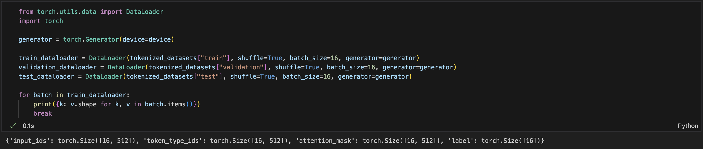

Dataset 用于存储样本及其对应的标签。而 Dataloader 是将 Dataset 进一步包装为一个可迭代对象，以实现数据打乱、小批量读取等功能。


## 定义分类模型

原始 BERT 本质上是一个特征提取器，它的输出是文本的语义向量表示（embedding），不包含分类逻辑，因此需要在 BERT 的基础上进行一些修改和扩展，以适应文本分类任务：

```python
import torch.nn as nn
from transformers import BertModel

class BertClassifier(nn.Module):
    def __init__(self, num_labels):
        super(BertClassifier, self).__init__()
        self.bert = BertModel.from_pretrained("google-bert/bert-base-uncased")
        self.dropout = nn.Dropout(self.bert.config.hidden_dropout_prob)
        self.classifier = nn.Linear(self.bert.config.hidden_size, num_labels)

    def forward(self, **inputs):
        outputs = self.bert(**inputs)
        pooled_output = outputs.pooler_output
        pooled_output = self.dropout(pooled_output)
        logits = self.classifier(pooled_output)
        return logits

model = BertClassifier(num_labels=len(main_types))
```


另外其实 Hugging Face Transformers 库提供了封装好的分类模型，以下代码可证明自定义模型和 BertForSequenceClassification 基本一致，但 BertForSequenceClassification 还封装了多种分类任务和loss自动计算等：

```python
from transformers import BertForSequenceClassification

model_builtin = BertForSequenceClassification.from_pretrained("google-bert/bert-base-uncased", num_labels=len(main_types))

model.classifier.weight.data = model_builtin.classifier.weight.data.clone()
model.classifier.bias.data = model_builtin.classifier.bias.data.clone()

inputs = tokenizer("Hello World!", return_tensors='pt')

# 使用eval模式关闭Dropout的随机性
model.eval()
model_builtin.eval()

print( model(**inputs) == model_builtin(**inputs).logits )
print( nn.CrossEntropyLoss()( model(**inputs).view(-1, len(main_types)), torch.tensor(1).view(-1) ) == model_builtin(**inputs, labels=torch.tensor(1)).loss )
```

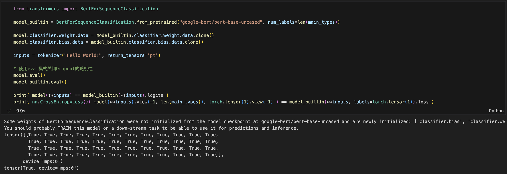


## 训练和保存模型

一个最基本的训练循环就如下所示：

```python
from torch.optim import AdamW

def train(lr, epochs, dataloader, model):
    model.train()

    loss_fct = nn.CrossEntropyLoss()
    optimizer = AdamW(model.parameters(), lr=lr)

    for epoch in range(epochs):
        for batch in dataloader:
            inputs = {
                "input_ids": batch["input_ids"], 
                "token_type_ids": batch['token_type_ids'], 
                "attention_mask": batch["attention_mask"]
            }
            outputs = model(**inputs)
            batch_loss = loss_fct(outputs, batch["label"])
            batch_loss.backward()
            optimizer.step()
            optimizer.zero_grad()
```

但一般还需要加入进度和指标反馈，验证集评估，另外我也添加了自动保存模型权重的代码：

```python
from torch.optim import AdamW
from tqdm.auto import tqdm

def train(lr, epochs, model, train_dataloader, validation_dataloader):
    loss_fct = nn.CrossEntropyLoss()
    optimizer = AdamW(model.parameters(), lr=lr)

    train_losses, train_accs, val_losses, val_accs = [],[],[],[]
    best_val_acc = 0.0
    
    pbar = tqdm(total=epochs * len(train_dataloader))

    for epoch in range(epochs):
        model.train()
        train_loss, train_correct = 0, 0
        for batch in train_dataloader:
            inputs = {
                "input_ids": batch["input_ids"], 
                "token_type_ids": batch['token_type_ids'], 
                "attention_mask": batch["attention_mask"]
            }
            outputs = model(**inputs)
            batch_loss = loss_fct(outputs, batch["label"])
            batch_loss.backward()
            optimizer.step()
            optimizer.zero_grad()

            train_loss += batch_loss.item()
            train_correct += (outputs.argmax(1) == batch["label"]).sum().item()

            pbar.set_postfix({'lr':lr, 'epoch': f'{epoch + 1}/{epochs}', 'batch_loss': batch_loss.item(), 'best_val_acc': f'{best_val_acc:.3%}' })
            pbar.update(1)


        model.eval()
        val_loss, val_correct = 0, 0
        with torch.no_grad():
            for batch in validation_dataloader:
                inputs = {
                    "input_ids": batch["input_ids"], 
                    "token_type_ids": batch['token_type_ids'], 
                    "attention_mask": batch["attention_mask"]
                }
                outputs = model(**inputs)
                batch_loss = loss_fct(outputs, batch["label"])
                
                val_loss += batch_loss.item()
                val_correct += (outputs.argmax(1) == batch["label"]).sum().item()


        train_losses.append( train_loss / len(train_dataloader) )
        train_accs.append( train_correct / len(train_dataloader.dataset) )
        val_losses.append( val_loss / len(validation_dataloader) )
        val_accs.append( val_correct / len(validation_dataloader.dataset) )

        if val_accs[-1] > best_val_acc:
            best_val_acc = val_accs[-1]
            torch.save(model.state_dict(), f"model_lr_{lr}_epoch_{epoch+1}_acc_{best_val_acc:.5}.pt")
    
    return train_losses, train_accs, val_losses, val_accs
```

[原论文附录A.3](https://ar5iv.labs.arxiv.org/html/1810.04805)中建议的微调参数如下：

* Batch size: 16, 32
* Learning rate (Adam): 5e-5, 3e-5, 2e-5
* Number of epochs: 2, 3, 4


当前设置的 Batch size 为16，为了对比不同超参数的效果，我使用3种学习率分别训练了10个epoch（模型权重会在每次训练后更新，所以使用新的超参数训练前需要重置模型参数或者重新实例化model）：

```python
lr_list = [5e-5, 3e-5, 2e-5]
train_losses_list, train_accs_list, val_losses_list, val_accs_list = [],[],[],[]
for lr in lr_list:
    model = BertClassifier(num_labels=len(main_types))
    train_losses, train_accs, val_losses, val_accs = train(lr=lr, epochs=10, model=model, train_dataloader=train_dataloader, validation_dataloader=validation_dataloader)
    train_losses_list.append(train_losses)
    train_accs_list.append(train_accs)
    val_losses_list.append(val_losses)
    val_accs_list.append(val_accs)
```

用 Tesla T4 跑了约7个小时：

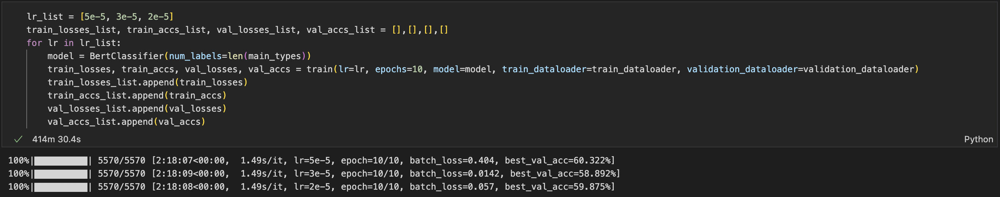

可以通过绘图直观的看到训练过程和结果：

```python
print(f"{train_losses_list}, {train_accs_list}, {val_losses_list}, {val_accs_list}")

def plot_subplot(ax, title, train_losses, train_accs, val_losses, val_accs):
    ax.plot(train_losses, label="train_losses", linestyle='--')
    ax.plot(train_accs, label=f"train_accs (max: {train_accs.index(max(train_accs))}, {max(train_accs):.3%})", linestyle='--')
    ax.plot(val_losses, label="val_losses")
    ax.plot(val_accs, label=f"val_accs (max: {val_accs.index(max(val_accs))}, {max(val_accs):.3%})")
    ax.legend(frameon=False)
    ax.set_xlabel("Epoch")
    ax.set_title(title)

fig, axes = plt.subplots(1, 3, figsize=(18, 4))
for idx, lr in enumerate(lr_list):
    plot_subplot(
        axes[idx], 
        f"lr={lr}", 
        train_losses_list[idx], 
        train_accs_list[idx], 
        val_losses_list[idx], 
        val_accs_list[idx]
    )
plt.tight_layout()
plt.show()
```

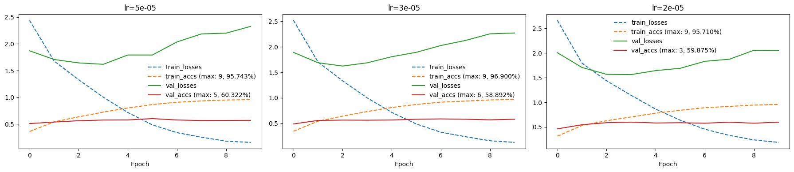


以下是 Batch size 为32时的训练结果：

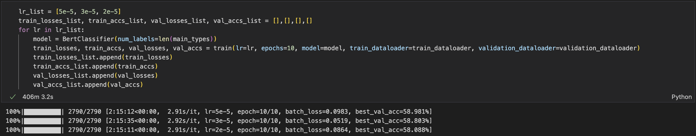

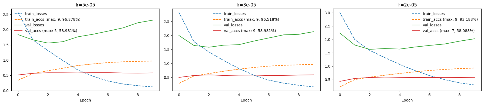


整体结果都差不多，但是有一个比较违反直觉的现象，验证集 loss 上升时，准确率却保持稳定甚至上升，关于这个问题可以参考 https://www.zhihu.com/question/318399418 


## 加载和评估模型

`torch.save(model.state_dict(), PATH)` 只会保存模型学习到的参数（即权重和偏差），所以仍需要模型的原始定义和实例来加载模型：

```python
import torch.nn as nn
from transformers import BertModel

class BertClassifier(nn.Module):
    def __init__(self, num_labels):
        super(BertClassifier, self).__init__()
        self.bert = BertModel.from_pretrained("google-bert/bert-base-uncased")
        self.dropout = nn.Dropout(self.bert.config.hidden_dropout_prob)
        self.classifier = nn.Linear(self.bert.config.hidden_size, num_labels)

    def forward(self, **inputs):
        outputs = self.bert(**inputs)
        pooled_output = outputs.pooler_output
        pooled_output = self.dropout(pooled_output)
        logits = self.classifier(pooled_output)
        return logits

model = BertClassifier(num_labels=len(main_types))
model.load_state_dict(torch.load('./model_lr_5e-05_epoch_6_acc_0.60322.pt', weights_only=True, map_location=device))
model.eval()
```


Accuracy 是分类问题中最常用的指标（正确的预测数与总预测数的比值），但对于不平衡的数据集而言，它并不是一个好的指标（参考 https://zhuanlan.zhihu.com/p/147663370）。所以我又用了 F1-score 和混淆矩阵来评估模型：

```python
from sklearn.metrics import accuracy_score, f1_score, confusion_matrix
import matplotlib.pyplot as plt
import seaborn as sns
from tqdm.auto import tqdm

def evaluate(model, dataloader):
    model.eval()
    all_preds = []
    all_labels = []
    with torch.no_grad():
        for batch in tqdm(dataloader):
            inputs = {
                "input_ids": batch["input_ids"], 
                "token_type_ids": batch['token_type_ids'], 
                "attention_mask": batch["attention_mask"]
            }
            outputs = model(**inputs)
            preds = outputs.argmax(1)
            all_preds.extend(preds.cpu().numpy())
            all_labels.extend(batch["label"].cpu().numpy())

    accuracy = accuracy_score(all_labels, all_preds)
    f1 = f1_score(all_labels, all_preds, average='macro')
    cm = confusion_matrix(all_labels, all_preds)
    return accuracy, f1, cm

def plot_confusion_matrix(title, cm, labels):
    plt.figure(figsize=(15, 10))
    sns.heatmap(cm, annot=True, fmt='d', cmap='Blues', xticklabels=labels, yticklabels=labels)
    plt.xlabel('Predicted Labels')
    plt.ylabel('True Labels')
    plt.title(title)
    plt.show()

accuracy, f1, cm = evaluate(model, test_dataloader)
plot_confusion_matrix(f'accuracy: {accuracy:.3%}, f1: {f1:.5}', cm, main_types)
```

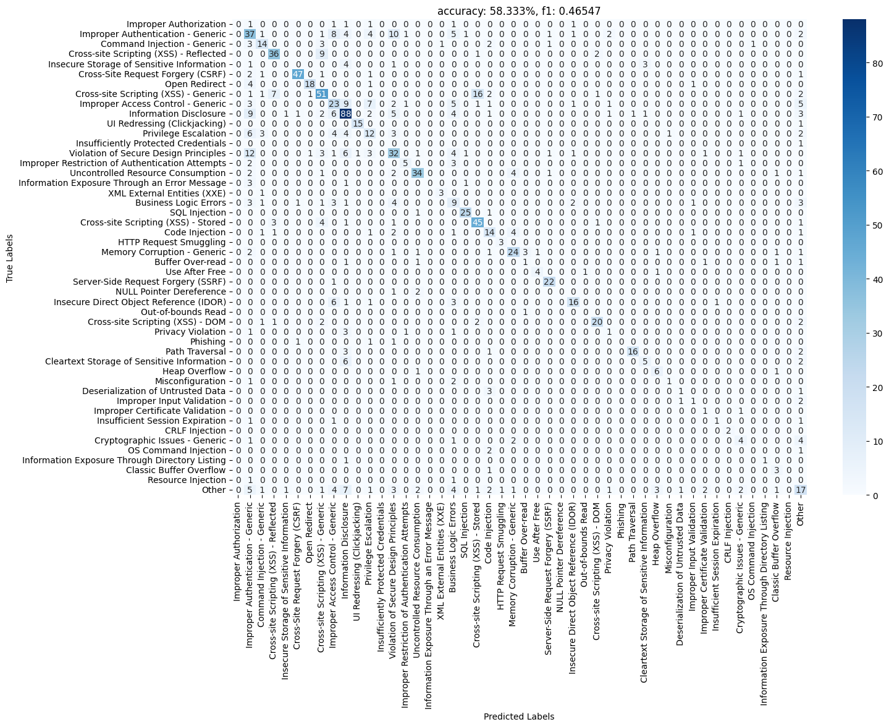

从分数来看模型的表现并不是很好，但从混淆矩阵发现的一些分类错误说明分类标签的定义和选择是有一定问题的。例如其中最明显的错误是模型将16个类型为 `Cross-site Scripting (XSS) - Generic` 的数据分类为了 `Cross-site Scripting (XSS) - Stored` ，但我认为后者应该算前者的子集，这两个类型不应该并列存在。还有将12个类型为 `Violation of Secure Design Principles` 的数据分类为了 `Improper Authentication - Generic`，前者定义太过宽泛，后者其实也可以算前者子集。

可以看看具体的数据：

```python
from transformers import BertTokenizer

tokenizer = BertTokenizer.from_pretrained("google-bert/bert-base-uncased")

all_preds = []
all_labels = []
all_input_ids = []
with torch.no_grad():
    for batch in test_dataloader:
        inputs = {
            "input_ids": batch["input_ids"], 
            "token_type_ids": batch['token_type_ids'], 
            "attention_mask": batch["attention_mask"]
        }
        outputs = model(**inputs)
        preds = outputs.argmax(1)
        labels = batch["label"]
        all_preds.extend(preds.tolist())
        all_labels.extend(labels.tolist())
        all_input_ids.extend(inputs["input_ids"])

def get_datas(true_label_str, pred_label_str):
    true_label = main_types.index(true_label_str)
    pred_label = main_types.index(pred_label_str)
    datas = []
    for i in range(len(all_labels)):
        if all_labels[i] == true_label and all_preds[i] == pred_label:
            datas.append(tokenizer.decode(all_input_ids[i]))
    return datas
  
for data in get_datas('Cross-site Scripting (XSS) - Generic', 'Cross-site Scripting (XSS) - Stored'):
    print(data)
```

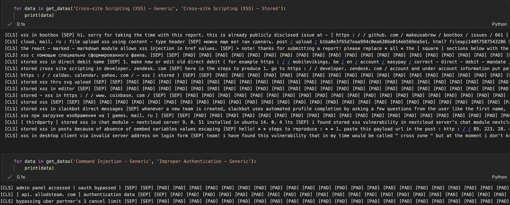

很多报告没有内容，只有标题，导致模型无法准确判断，另外有些关于 XSS 的报告标题中就有 "Stored XSS" 且没有报告内容，模型其实算是判断准确了。


## 处理数据重新训练

首先我去除掉了只有标题没有内容的这类数据，然后 HackerOne 的漏洞报告其实是按 CWE 分类的，感觉 CWE 的类别太多了，所以我打算尝试以 OWASP Top 10 为标准重新给这些漏洞分类，截止写这篇笔记时  **OWASP Top 10:2025** 还没发布，只能参考 **OWASP Top 10:2021**。

以下脚本可用于获取 OWASP 网页中 OWASP Top 10 分别包含的 CWE 名称并创建 CWE 到 OWASP Top 10 的字典：

```python
import requests
import re

def get_top10_name_and_link():
    res = requests.get("https://owasp.org/Top10/").text
    pattern = re.compile(r'<strong><a href="(.*?)">(.*?)</a></strong>')
    matches = pattern.findall(res)
    result = []
    for link, name in matches:
        result.append({
            "link":link.strip(),
            "name":name.strip()
        })
    return result

def get_cwe(link):
    url = "https://owasp.org/Top10/"+link
    res = requests.get(url).text
    pattern = re.compile(r'<p><a href="https://cwe.mitre.org/data/definitions/.*?">(.*?) (.*?)</a></p>')
    matches = pattern.findall(res)
    result = []
    for number, name in matches:
        result.append({
            "number":number.strip(),
            "name":name.strip()
        })
    return result

cwe_top10_dict = {}
top10 = get_top10_name_and_link()
top10_list = [item["name"] for item in top10]
for item in top10:
    cwe = get_cwe(item["link"])
    for c in cwe:
        cwe_top10_dict[c['name']] = top10_list.index(item['name'])

print(f'top10_list: {top10_list}')
print(f'cwe_top10_dict: {cwe_top10_dict}')
```

重新分类后发现大多数漏洞都没有归类到 OWASP Top 10 ，首先有可能是 OWASP 网页中 OWASP Top 10 分别包含的 CWE 列表并不全，其次有可能数据集中的 CWE 名称并不标准，而且后面我看[CWE官网](https://cwe.mitre.org/data/definitions/287.html)，发现这套分类标准真挺复杂的，每个 CWE 有不同的类型，有父项、子项、成员。

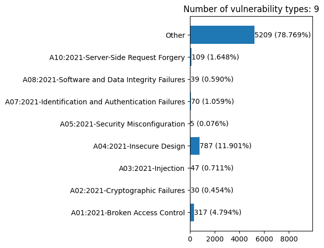


然后我还是打算直接通过这些类别名称进行归并一下，比如所有不同类型的 XSS 都可以归为一类，SSRF 在原数据集中也有两个名称（`Server-Side Request Forgery (SSRF)` 和 `Server Side Request Forgery`），这也可以合并。

这件事可以用大模型来做，试了下豆包效果还不错，但是会漏掉很多类型，需要自己归类到 Other：

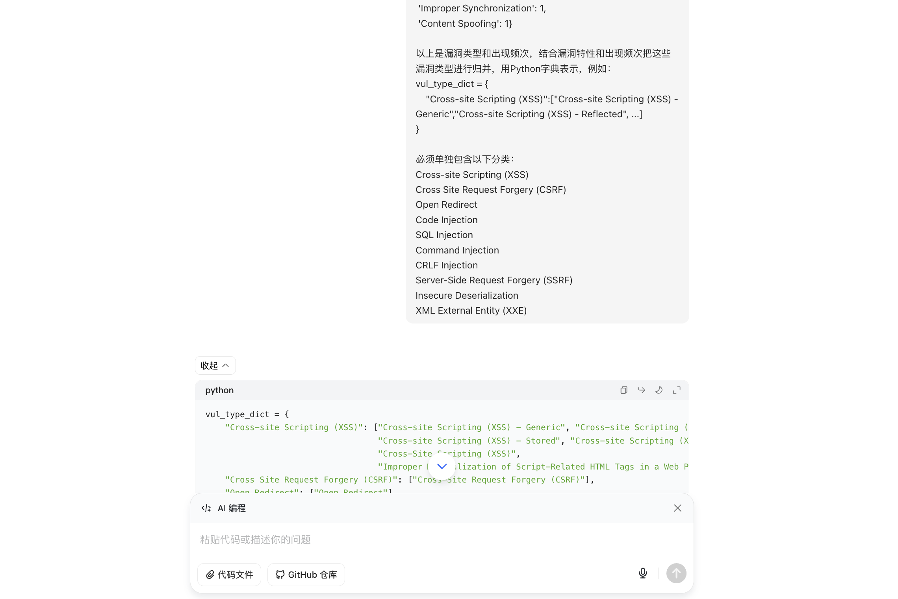

最终分类结果：

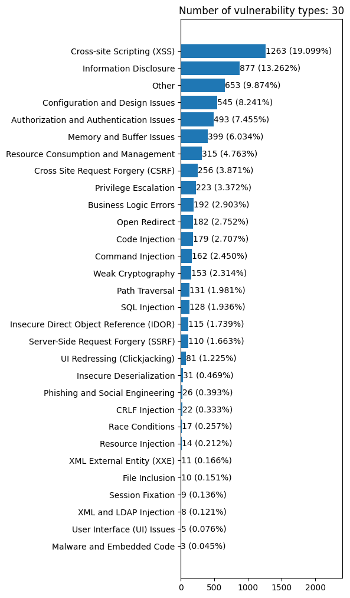


这次直接使用了 transformers 库中封装好的 BertForSequenceClassification 模型，且在处理数据时把之前的 label 字段重命名为了 labels ，这是标准的命名，在后续训练时可以自动计算 loss，完整代码在：https://github.com/l3yx/VulBERT/blob/main/train_v2.ipynb

```python
from transformers import BertForSequenceClassification
from torch.optim import AdamW
from tqdm.auto import tqdm

model = BertForSequenceClassification.from_pretrained("google-bert/bert-base-uncased", num_labels=len(vul_type))

def train(lr, epochs, model, train_dataloader, validation_dataloader):
    optimizer = AdamW(model.parameters(), lr=lr)

    train_losses, train_accs, val_losses, val_accs = [],[],[],[]
    best_val_acc = 0.0
    
    pbar = tqdm(total=epochs * len(train_dataloader))

    for epoch in range(epochs):
        model.train()
        train_loss, train_correct = 0, 0
        for batch in train_dataloader:
            outputs = model(**batch)
            batch_loss = outputs.loss
            batch_loss.backward()
            optimizer.step()
            optimizer.zero_grad()

            train_loss += batch_loss.item()
            train_correct += (outputs.logits.argmax(1) == batch["labels"]).sum().item()

            pbar.set_postfix({'lr':lr, 'epoch': f'{epoch + 1}/{epochs}', 'batch_loss': batch_loss.item(), 'best_val_acc': f'{best_val_acc:.3%}' })
            pbar.update(1)


        model.eval()
        val_loss, val_correct = 0, 0
        with torch.no_grad():
            for batch in validation_dataloader:
                outputs = model(**batch)
                batch_loss = outputs.loss
                
                val_loss += batch_loss.item()
                val_correct += (outputs.logits.argmax(1) == batch["labels"]).sum().item()


        train_losses.append( train_loss / len(train_dataloader) )
        train_accs.append( train_correct / len(train_dataloader.dataset) )
        val_losses.append( val_loss / len(validation_dataloader) )
        val_accs.append( val_correct / len(validation_dataloader.dataset) )

        if val_accs[-1] > best_val_acc:
            best_val_acc = val_accs[-1]
            torch.save(model.state_dict(), f"model_lr_{lr}_epoch_{epoch+1}_acc_{best_val_acc:.5}.pt")
    
    return train_losses, train_accs, val_losses, val_accs
```


结果为：

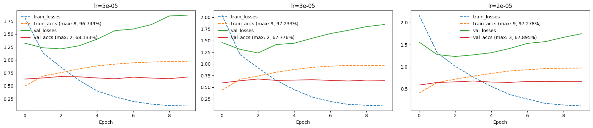

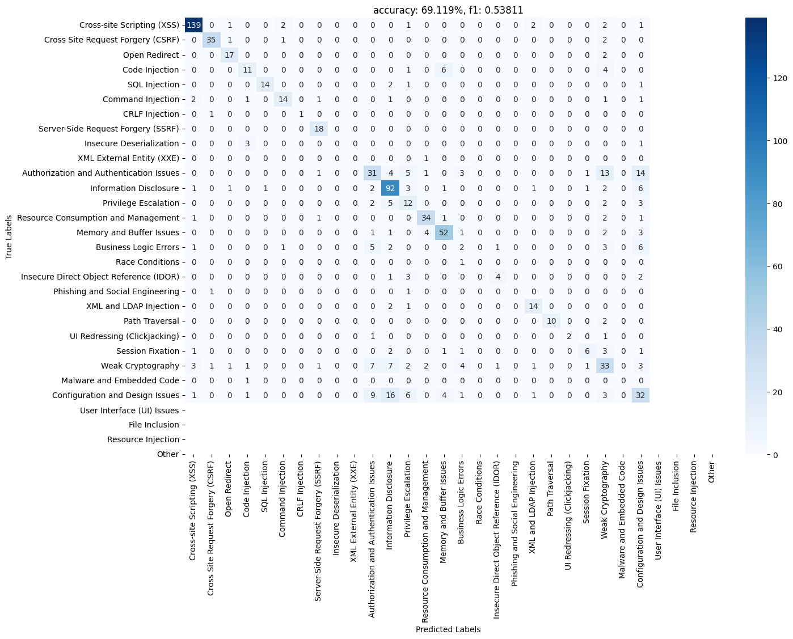

看起来测试集中缺少了部分漏洞类型，另外从混淆矩阵中可以看出漏洞分类其实还是有点不合理，比如有16个 `Configuration and Design Issues` 被分为了 `Information Disclosure` ，这两种确实会有交错重叠，或许漏洞分类本身就应该是个多标签分类任务。


## 参考

https://jalammar.github.io/illustrated-bert/

https://ar5iv.labs.arxiv.org/html/1810.04805

https://huggingface.co/learn/nlp-course/zh-CN/chapter3/4

https://pytorch.org/tutorials/intermediate/char_rnn_classification_tutorial.html


